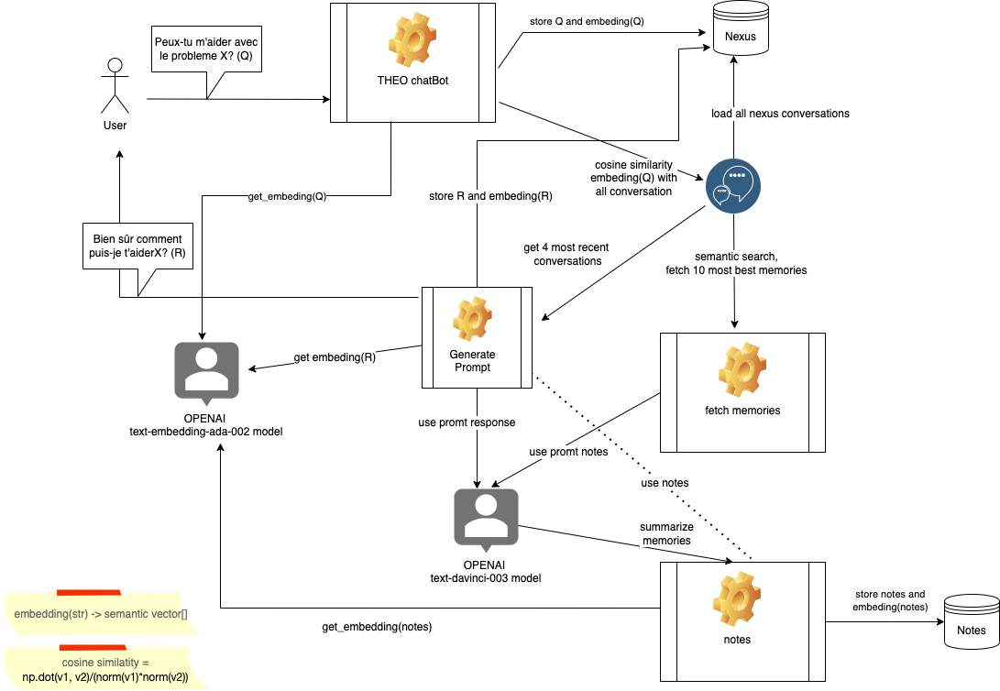

# GPT LTM chatbot

Version francaise d'un bot basé sur GPT-3 d'OPEN AI avec une gestion de la mémoire à long terme et une recherche sémentique dans cette mémoire via la technique du "embedding".

## Prerequisites

-   Python3 installed
-   OpenAI api key obtained by registering with OpenAI

## Setup

1.  Clone the repository to your local PC: `git clone https://github.com/daveshap/LongtermChatExternalSources.git`
2.  Create a virtual environment: `python3 -m venv env`
3.  Activate the environment: `source env/bin/activate`
4.  Install the required packages: `pip3 install openai numpy`
5.  Copy your OpenAI api key to a file named `openaiapikey.txt` in the project directory. Ensure there is no trailing newline.

## Usage

Run the script: `python chat.py`

Once the script is running, you can interact with the chatbot through the command line. 
